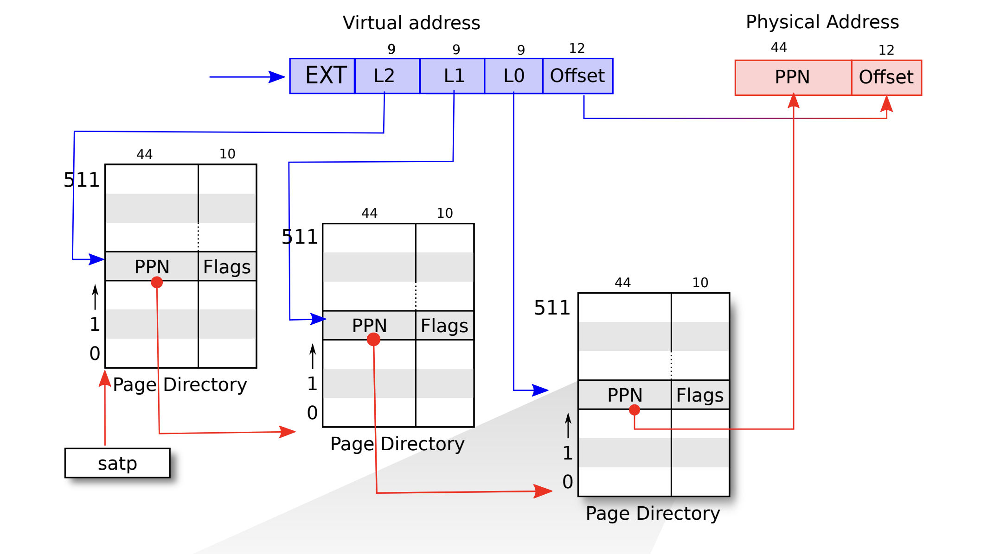

# MP3 - Page Table and Paging
## Introduction

In this project, we will begin with a **Trace Code** section to help you understand the current paging and virtual memory mechanisms in xv6. Following that, in the **Implementation** section, you will first familiarize yourself with printing out page tables and then add a read-only page to further solidify your understanding. Subsequently, you will be required to implement new features to support lazy allocation and swapping in the xv6 system. We will provide several hints and list the files you may need to modify. However, you are free to develop your own implementation, provided it passes all test cases and you clearly document your solution.

### Instructions
Refer to link [student guide](https://git.lsalab.cs.nthu.edu.tw/os25/os25_shared_xv6/src/branch/student/) to launch the development environment.

## Trace Code

1. How does xv6 run a user program?
    1. kernel/main.c/main()
    2. kernel/proc.c/scheduler()
    3. kernel/switch.S
    4. kernel/proc.c/forkret()
    5. kernel/trap.c/usertrapret()
    6. kernel/trampoline.S/userret: (Note: In userinit function, we put initcode into the user page table)
    7. kernel/exec.c/exec()
2. How does xv6 allocate physical memory and map it into the process’s virtual address space?
    1. user/user.h/sbrk()
    2. user/usys.pl
    3. kernel/sysproc.c/sys_sbrk()
    4. kernel/proc.c/growproc()
    5. kernel/vm.c/uvmalloc()

## Implementation
In this part, you will implement code within the xv6 source code. You are expected to write your code, test its functionality, and document your work in the report file. You may design your own solution, provided its architecture is reasonable.
Hint: **See the Appendix for more information to compelete this assignment**
### **1.** Print Page Table

> A single page table for a process with a large virtual address space would consume too much memory. To solve this, modern operating systems use **multi-level page tables**, which create a tree-like structure. Lower-level tables are allocated only when needed, saving significant memory.
> 
> 
> RISC-V xv6 uses a three-level page table. In this section, you will implement vmprint() to traverse and display this page table tree for a given process. You can get the full test credit if you pass the test mp3_0. 

> 
> **Reference the above diagram for the following calculations:**
> *   **PTE (Page Table Entry):** Combine the **PPN** and **Flags**.
> *   **Virtual Address (VA):** Combine the **L2, L1, and L0** indices.
> *   **Physical Address (PA):** Use the **PPN** value.
>
> **Note:** When displaying the Virtual Address (VA) and Physical Address (PA), exclude the offset.
>
Files you may need to change:

- `kernel/vm.c`

Expected output:

```bash
$ mp3_0
page table 0x0000000087f4e000
  0: pte=0x0000000021fd2801 va=0x0000000000000000 pa=0x0000000087f4a000 V
    0: pte=0x0000000021fd2401 va=0x0000000000000000 pa=0x0000000087f49000 V
      0: pte=0x0000000021fd2c5b va=0x0000000000000000 pa=0x0000000087f4b000 V R X U
      1: pte=0x0000000021fd2017 va=0x0000000000001000 pa=0x0000000087f48000 V R W U
      2: pte=0x0000000021fd1c07 va=0x0000000000002000 pa=0x0000000087f47000 V R W
      3: pte=0x0000000021fd18d7 va=0x0000000000003000 pa=0x0000000087f46000 V R W U
  255: pte=0x0000000021fd3401 va=0x0000003fc0000000 pa=0x0000000087f4d000 V
    511: pte=0x0000000021fd3001 va=0x0000003fffe00000 pa=0x0000000087f4c000 V
      509: pte=0x0000000021fdc413 va=0x0000003fffffd000 pa=0x0000000087f71000 V R U
      510: pte=0x0000000021fd78c7 va=0x0000003fffffe000 pa=0x0000000087f5e000 V R W
      511: pte=0x0000000020001c4b va=0x0000003ffffff000 pa=0x0000000080007000 V R X
```

Notes:

1. The first line displays the argument to vmprint.
2. After that, there is a line for each PTE, including PTEs that refer to page-table pages deeper in the tree.
3. Each PTE line is indented by $2*(3 - level)$ spaces
4. Each PTE line shows:
    1. The PTE index in its page-table page 
    2. full 64-bit hex PTEs
    3. virtual address and physical address of PTEs (without offset)
    4. The PTE flag bits V, R, W, X, U.
5. **physical address of PTEs can be different** to the example output.

Hints:

1. In the example above, the top-level page table has mappings in entries at indexes 0 and 255. The next level down for entry 0 has only index 0 mapped, and the bottom-level for that index 0 has entries 0, 1, 2, and 3 mapped.
2. Read ”Chapter 3” of the xv6 book (See Reference), and related files:
• `kernel/memlayout.h`, which captures the layout of memory.
• `kernel/vm.c`, which contains most virtual memory code.
3. Use the macros at the end of the file ‘kernel/riscv.h’.
4. Use `%p` in your `printf` calls to print out full 64-bit hex PTEs and addresses.

### 2. Add a read only share page

> To avoid expensive context switches, modern operating systems like Linux map non-sensitive information (e.g., the current time) to a read-only page that user space can access directly. This mechanism is known as **vDSO**. In this lab, you will implement a simplified version in xv6 to deepen your understanding of virtual memory management.
> 

For each process, you will allocate a single read-only page mapped at the fixed virtual address `USYSCALL` (defined in `memlayout.h`). This page will contain a struct usyscall holding the process's ID (PID).

Files you may need to change:

- `kernel/proc.h`
- `kernel/proc.c`

Expected output:

```bash
$ mp3_1
ugetpid_test starting
ugetpid_test: OK
page table 0x0000000087f5f000
  0: pte=0x0000000021fd4801 va=0x0000000000000000 pa=0x0000000087f52000 V
    0: pte=0x0000000021fd4c01 va=0x0000000000000000 pa=0x0000000087f53000 V
      0: pte=0x0000000021fd445b va=0x0000000000000000 pa=0x0000000087f51000 V R X U
      1: pte=0x0000000021fdb4d7 va=0x0000000000001000 pa=0x0000000087f6d000 V R W U
      2: pte=0x0000000021fd8407 va=0x0000000000002000 pa=0x0000000087f61000 V R W
      3: pte=0x0000000021fd88d7 va=0x0000000000003000 pa=0x0000000087f62000 V R W U
  255: pte=0x0000000021fd8001 va=0x0000003fc0000000 pa=0x0000000087f60000 V
    511: pte=0x0000000021fd4001 va=0x0000003fffe00000 pa=0x0000000087f50000 V
      509: pte=0x0000000021fd3413 va=0x0000003fffffd000 pa=0x0000000087f4d000 V R U
      510: pte=0x0000000021fd38c7 va=0x0000003fffffe000 pa=0x0000000087f4e000 V R W
      511: pte=0x0000000020001c4b va=0x0000003ffffff000 pa=0x0000000080007000 V R X
```

Notes:

- You can perform the mapping in `kernel/proc.c/proc_pagetable()`
- Choose permission bits that allow userspace to only read the page. (See Appendix for permission bit reference)
- Don't forget to allocate and initialize the page in allocproc() and free the page in `freeproc()`.
- You can take `memlayout.h` for reference to design the usyscall read only page.


### 3. Generate a Page Fault

> Processes in modern operating systems can request vast amounts of virtual memory. Allocating physical memory immediately for these requests via calls like sbrk is often slow and wasteful if the memory goes unused. Modern systems therefore use **lazy allocation**: the OS only expands the process's virtual heap size initially. Physical memory pages are allocated and mapped only upon the first access to a page in this new virtual area, typically handled via a page fault. Your goal in this lab is to implement this lazy allocation feature for the sbrk system call.
> 

This lab requires you to modify xv6's `sbrk(n)` system call. Currently, `sbrk(n)` grows the process's virtual address space size (myproc()->sz) by n bytes and concurrently allocates the necessary physical memory.

To implement lazy allocation, you will alter `sbrk(n)` so that it **only** increments `myproc()->sz`, thereby expanding the process's virtual heap, but **defers the actual physical memory allocation**.

The second part of this lab involves handling the consequences of this deferred allocation. When the process attempts to access a page within the newly expanded (but not yet physically backed) virtual address range, a page fault will be triggered. Your objective is to complete the handle_pgfault() function in `paging.c`. This function should detect such page faults, allocate a physical memory page, map it to the faulting virtual address, and then allow the process to resume execution.

Files you may need to change:

`kernel/trap.c`

`kernel/sysproc.c`

`kernel/vm.c`

`kernel/paging.c`

Expected output:

```bash
$ mp3_2
# Before sbrk(PGSIZE * 2)
page table 0x0000000087f70000
  0: pte=0x0000000021fd2001 va=0x0000000000000000 pa=0x0000000087f48000 V
    0: pte=0x0000000021fd7801 va=0x0000000000000000 pa=0x0000000087f5e000 V
      0: pte=0x0000000021fd3c5b va=0x0000000000000000 pa=0x0000000087f4f000 V R X U
      1: pte=0x0000000021fdbc17 va=0x0000000000001000 pa=0x0000000087f6f000 V R W U
      2: pte=0x0000000021fd2c07 va=0x0000000000002000 pa=0x0000000087f4b000 V R W
      3: pte=0x0000000021fd18d7 va=0x0000000000003000 pa=0x0000000087f46000 V R W U
  255: pte=0x0000000021fdc401 va=0x0000003fc0000000 pa=0x0000000087f71000 V
    511: pte=0x0000000021fdb801 va=0x0000003fffe00000 pa=0x0000000087f6e000 V
      509: pte=0x0000000021fd8013 va=0x0000003fffffd000 pa=0x0000000087f60000 V R U
      510: pte=0x0000000021fd7cc7 va=0x0000003fffffe000 pa=0x0000000087f5f000 V R W
      511: pte=0x0000000020001c4b va=0x0000003ffffff000 pa=0x0000000080007000 V R X

# After sbrk(PGSIZE * 2)
page table 0x0000000087f70000
  0: pte=0x0000000021fd2001 va=0x0000000000000000 pa=0x0000000087f48000 V
    0: pte=0x0000000021fd7801 va=0x0000000000000000 pa=0x0000000087f5e000 V
      0: pte=0x0000000021fd3c5b va=0x0000000000000000 pa=0x0000000087f4f000 V R X U
      1: pte=0x0000000021fdbc17 va=0x0000000000001000 pa=0x0000000087f6f000 V R W U
      2: pte=0x0000000021fd2c07 va=0x0000000000002000 pa=0x0000000087f4b000 V R W
      3: pte=0x0000000021fd18d7 va=0x0000000000003000 pa=0x0000000087f46000 V R W U
  255: pte=0x0000000021fdc401 va=0x0000003fc0000000 pa=0x0000000087f71000 V
    511: pte=0x0000000021fdb801 va=0x0000003fffe00000 pa=0x0000000087f6e000 V
      509: pte=0x0000000021fd8013 va=0x0000003fffffd000 pa=0x0000000087f60000 V R U
      510: pte=0x0000000021fd7cc7 va=0x0000003fffffe000 pa=0x0000000087f5f000 V R W
      511: pte=0x0000000020001c4b va=0x0000003ffffff000 pa=0x0000000080007000 V R X

# After sbrk(-PGSIZE * 2)
page table 0x0000000087f70000
  0: pte=0x0000000021fd2001 va=0x0000000000000000 pa=0x0000000087f48000 V
    0: pte=0x0000000021fd7801 va=0x0000000000000000 pa=0x0000000087f5e000 V
      0: pte=0x0000000021fd3c5b va=0x0000000000000000 pa=0x0000000087f4f000 V R X U
      1: pte=0x0000000021fdbc17 va=0x0000000000001000 pa=0x0000000087f6f000 V R W U
      2: pte=0x0000000021fd2c07 va=0x0000000000002000 pa=0x0000000087f4b000 V R W
      3: pte=0x0000000021fd18d7 va=0x0000000000003000 pa=0x0000000087f46000 V R W U
  255: pte=0x0000000021fdc401 va=0x0000003fc0000000 pa=0x0000000087f71000 V
    511: pte=0x0000000021fdb801 va=0x0000003fffe00000 pa=0x0000000087f6e000 V
      509: pte=0x0000000021fd8013 va=0x0000003fffffd000 pa=0x0000000087f60000 V R U
      510: pte=0x0000000021fd7cc7 va=0x0000003fffffe000 pa=0x0000000087f5f000 V R W
      511: pte=0x0000000020001c4b va=0x0000003ffffff000 pa=0x0000000080007000 V R X

# After sbrk(PGSIZE * 2) again
page table 0x0000000087f70000
  0: pte=0x0000000021fd2001 va=0x0000000000000000 pa=0x0000000087f48000 V
    0: pte=0x0000000021fd7801 va=0x0000000000000000 pa=0x0000000087f5e000 V
      0: pte=0x0000000021fd3c5b va=0x0000000000000000 pa=0x0000000087f4f000 V R X U
      1: pte=0x0000000021fdbc17 va=0x0000000000001000 pa=0x0000000087f6f000 V R W U
      2: pte=0x0000000021fd2c07 va=0x0000000000002000 pa=0x0000000087f4b000 V R W
      3: pte=0x0000000021fd18d7 va=0x0000000000003000 pa=0x0000000087f46000 V R W U
  255: pte=0x0000000021fdc401 va=0x0000003fc0000000 pa=0x0000000087f71000 V
    511: pte=0x0000000021fdb801 va=0x0000003fffe00000 pa=0x0000000087f6e000 V
      509: pte=0x0000000021fd8013 va=0x0000003fffffd000 pa=0x0000000087f60000 V R U
      510: pte=0x0000000021fd7cc7 va=0x0000003fffffe000 pa=0x0000000087f5f000 V R W
      511: pte=0x0000000020001c4b va=0x0000003ffffff000 pa=0x0000000080007000 V R X

# After page fault at 0x0000000000005000
page table 0x0000000087f70000
  0: pte=0x0000000021fd2001 va=0x0000000000000000 pa=0x0000000087f48000 V
    0: pte=0x0000000021fd7801 va=0x0000000000000000 pa=0x0000000087f5e000 V
      0: pte=0x0000000021fd3c5b va=0x0000000000000000 pa=0x0000000087f4f000 V R X U
      1: pte=0x0000000021fdbc17 va=0x0000000000001000 pa=0x0000000087f6f000 V R W U
      2: pte=0x0000000021fd2c07 va=0x0000000000002000 pa=0x0000000087f4b000 V R W
      3: pte=0x0000000021fd18d7 va=0x0000000000003000 pa=0x0000000087f46000 V R W U
      5: pte=0x0000000021fd24df va=0x0000000000005000 pa=0x0000000087f49000 V R W X U
  255: pte=0x0000000021fdc401 va=0x0000003fc0000000 pa=0x0000000087f71000 V
    511: pte=0x0000000021fdb801 va=0x0000003fffe00000 pa=0x0000000087f6e000 V
      509: pte=0x0000000021fd8013 va=0x0000003fffffd000 pa=0x0000000087f60000 V R U
      510: pte=0x0000000021fd7cc7 va=0x0000003fffffe000 pa=0x0000000087f5f000 V R W
      511: pte=0x0000000020001c4b va=0x0000003ffffff000 pa=0x0000000080007000 V R X

# After sbrk(-PGSIZE * 2) again
page table 0x0000000087f70000
  0: pte=0x0000000021fd2001 va=0x0000000000000000 pa=0x0000000087f48000 V
    0: pte=0x0000000021fd7801 va=0x0000000000000000 pa=0x0000000087f5e000 V
      0: pte=0x0000000021fd3c5b va=0x0000000000000000 pa=0x0000000087f4f000 V R X U
      1: pte=0x0000000021fdbc17 va=0x0000000000001000 pa=0x0000000087f6f000 V R W U
      2: pte=0x0000000021fd2c07 va=0x0000000000002000 pa=0x0000000087f4b000 V R W
      3: pte=0x0000000021fd18d7 va=0x0000000000003000 pa=0x0000000087f46000 V R W U
  255: pte=0x0000000021fdc401 va=0x0000003fc0000000 pa=0x0000000087f71000 V
    511: pte=0x0000000021fdb801 va=0x0000003fffe00000 pa=0x0000000087f6e000 V
      509: pte=0x0000000021fd8013 va=0x0000003fffffd000 pa=0x0000000087f60000 V R U
      510: pte=0x0000000021fd7cc7 va=0x0000003fffffe000 pa=0x0000000087f5f000 V R W
      511: pte=0x0000000020001c4b va=0x0000003ffffff000 pa=0x0000000080007000 V R X
```

Note:

1. Modify `usertrap()` in `/kernel/trap.c` to handle page fault. You can use `r_scause() == 13 || r_scause() == 15` to catch page fault events in usertrap().
2. Newly allocated pages always have PTE U, PTE R, PTE W, PTE X flags.
3. You may delete or change the call to `growproc()`
4. You may change proc `freepagetable()` in `proc.c` and `uvmunmap()` in `vm.c` so that they don’t fail on unallocated pages.
5. The argument n to `sbrk(n)` can be negative. If n is negative, your implementation should deallocate (or free) the corresponding amount of memory.
6. The testing program always triggers page fault on legal memory addresses.


### 4. Demand Paging and Swapping

> Demand paging with swapping is an elegant technique for extending available memory by using secondary storage for pages not currently in active use. This allows processes to operate with a larger virtual address space than the physical memory installed. In this section, your task is to implement the madvise() system call in xv6. madvise() provides hints to the operating system about a process's expected memory access patterns, helping the OS optimize its paging decisions, such as determining which pages to swap to disk and which to bring back into main memory.
> 

The behavior of `madvise()` obeys the following rules.

- The addr and length describes the range of the memory region.
- If a portion of the memory region exceeds the process memory size (`myproc()->sz`), it returns -1.
- The advice is an option how the region is expected to use. It accepts the following values:
    - `MADV_NORMAL`: No special treatment. Nothing to be done.
    - `MADV_WILLNEED`: Expect access in the near future. It allocates the physical memory pages for the affected memory region, including swapped pages and unallocated pages.
    - `MADV_DONTNEED`: Do not expect access in the near future. Any page is still in
    physical memory within the memory region will be moved to the swap space.
- If the operation succeeds, return 0.

The following works should be done in this part:

- Extend the the `vmprint()` function to show the PTE S bit and the block number of each page table entry (PTE), if the entry points to a swapped page.
- Implement the `MADV_NORMAL` option in `madvise()` in `/kernel/vm.c`. It should check the given memory region is valid or not.
- Implement the `MADV_DONTNEED` option. Those pages still in physical memory within the region are moved to the disk. It sets the PTE S bit and cancels the PTE V bit on affected page table entries
- Implement the `MADV_WILLNEED `option to place the correspond the physical
memory from the disk back to physical memory and allocate pages for those not allocated yet.

Files you may need to change:

`kernel/vm.c`

Expected output:

```bash
$ mp3_3
# Before madvise()
page table 0x0000000087f61000
  0: pte=0x0000000021fd2801 va=0x0000000000000000 pa=0x0000000087f4a000 V
    0: pte=0x0000000021fd3801 va=0x0000000000000000 pa=0x0000000087f4e000 V
      0: pte=0x0000000021fd305b va=0x0000000000000000 pa=0x0000000087f4c000 V R X U
      1: pte=0x0000000021fd3417 va=0x0000000000001000 pa=0x0000000087f4d000 V R W U
      2: pte=0x0000000021fd4407 va=0x0000000000002000 pa=0x0000000087f51000 V R W
      3: pte=0x0000000021fd88d7 va=0x0000000000003000 pa=0x0000000087f62000 V R W U
      5: pte=0x0000000021fd4cdf va=0x0000000000005000 pa=0x0000000087f53000 V R W X U
  255: pte=0x0000000021fdb401 va=0x0000003fc0000000 pa=0x0000000087f6d000 V
    511: pte=0x0000000021fd1c01 va=0x0000003fffe00000 pa=0x0000000087f47000 V
      509: pte=0x0000000021fdc413 va=0x0000003fffffd000 pa=0x0000000087f71000 V R U
      510: pte=0x0000000021fdc0c7 va=0x0000003fffffe000 pa=0x0000000087f70000 V R W
      511: pte=0x0000000020001c4b va=0x0000003ffffff000 pa=0x0000000080007000 V R X

# After madvise()
page table 0x0000000087f61000
  0: pte=0x0000000021fd2801 va=0x0000000000000000 pa=0x0000000087f4a000 V
    0: pte=0x0000000021fd3801 va=0x0000000000000000 pa=0x0000000087f4e000 V
      0: pte=0x0000000021fd305b va=0x0000000000000000 pa=0x0000000087f4c000 V R X U
      1: pte=0x0000000021fd3417 va=0x0000000000001000 pa=0x0000000087f4d000 V R W U
      2: pte=0x0000000021fd4407 va=0x0000000000002000 pa=0x0000000087f51000 V R W
      3: pte=0x0000000021fd88d7 va=0x0000000000003000 pa=0x0000000087f62000 V R W U
      5: pte=0x00000000000f42de va=0x0000000000005000 pa=0x00000000003d0000 blockno=0x00000000000003d0 R W X U S
  255: pte=0x0000000021fdb401 va=0x0000003fc0000000 pa=0x0000000087f6d000 V
    511: pte=0x0000000021fd1c01 va=0x0000003fffe00000 pa=0x0000000087f47000 V
      509: pte=0x0000000021fdc413 va=0x0000003fffffd000 pa=0x0000000087f71000 V R U
      510: pte=0x0000000021fdc0c7 va=0x0000003fffffe000 pa=0x0000000087f70000 V R W
      511: pte=0x0000000020001c4b va=0x0000003ffffff000 pa=0x0000000080007000 V R X
```

Note:
- The hidden test case will trigger a page fault **on a page that has been swapped to disk**.

<!-- ### Bonus: Design your own test case(5%)
Design your own test cases to test your code. Describe your test cases in your report to earn points. You can choose some of the functionality to test (you don't need to write testcases for the whole project), and your score will be determined by how complete your test cases are.  -->


## Grading
1. Implementation correctness (60%)
    * Correctness of print page table
    * Correctness of read only share page
    * Correctness of modified sbrk(n) system call
    * Correctness of madvise
    * Passing all public testcases gets (60% * 70% = 42%)
    * Passing the remaining private testcases gets the rest (60% * 30% = 18%)
2. Report (20%)
	* The report must detail team member contributions, provide an explanation of the trace code, and offer a clear explanation of your implementation.
	* Name the report “mp3_report_[GroupNumber].md”, and upload it to eeclass.
3. Demo (20%)
	* You will have a 15-minute session to answer TA questions regarding your implementation and specific details of the trace code.
4. Bonus (5%)
    * Refer to section "Rule for bonus" in [student guide](https://github.com/NTHU-LSALAB/xv6-Template/tree/student)
5. Plagiarism check
    * Never show your code to others.
    * If your code is found to be similar to others, including sources from the internet, and you cannot answer questions properly about your code during the demo, you will be considered as plagiarizing and will receive a score of **0** for the assignment.

## Appendix


### Macros and Builtin Types

#### Headers

To use the macros and builtin types on XV6 kernel code, the following headers must be included.

```c
#include "types.h"
#include "param.h"
#include "riscv.h"
```

#### Naming Convention

- PA - Physical address
- VA - Virtual address
- PG - Page
- PTE - Page table entry
- BLOCKNO - Block number on a device or a disk
- PGTBL - Page table

#### Page Alignment

The following macros convert a memory address to a page aligned value.

- PGSIZE
The page size, which is 4096.
- PGSHIFT
The number of offset bits in memory address, which is 12.
- PGROUNDUP(sz)
Round the memory address to multiple of 4096 greater than or equal to sz.
- PGROUNDDOWN(sz)
Round the memory address to multiple of 4096 less than or equal to sz.

#### Page table entry (PTE) Constants and Macros

A page table entry is a 64-bit integer, consisting of 10 low flag bits and remaining high address bits. The flag bits includes PTE V, PTE R, PTE W, PTE X, PTE U, PTE S.
* PTE V
If set, the high bits represent a valid memory address.
* PTE R
If set, the page at the address can be read.
* PTE W
If set, the page at the address can be written.
* PTE X
If set, the code on the page at the address can be executed.
* PTE U
If set, the page at the address is visible to userspace.
* PTE S
If set, the high bits represent the block number of a swapped page.
They can be used to check, set or unset flag bits on a page table entry.

```c
pte_t *pte = walk(pagetable, va, 0);
/* Check if PTE_V bit is set */
if (*pte & PTE_V) { /* omit */ }
/* Set the PTE_V bit */
*pte |= PTE_V;
/* Unset the PTE_V bit */
*pte &= ~PTE_V;
```

The high bits must be a valid address if PTE V bit is set. The following macros are used to convert a physical address to the high bits of PTE, and vice versa.

```c
pte_t *pte = walk(pagetable, va, 0);
if (*pte & PTE_V) {
/* Get the PA from a PTE */
uint64 pa = PTE2PA(*pte);
/* Create a PTE from a PA and flag bits */
*pte = PA2PTE(pa) | PTE_FLAGS(*pte);
}
```

If a PTE points to a swapped page, the PTE S bit is set but PTE V isn’t. The high bits represents the block number on ROOTDEV device.

```c
pte_t *pte = walk(pagetable, va, 0);
if (*pte & PTE_S) {
/* Get the BLOCKNO from a PTE */
uint64 blockno = PTE2BLOCKNO(*pte);
char *pa = kalloc(); /* Assume pa != 0 */
read_page_from_disk(ROOTDEV, pa, blockno);
/* Create a PTE from a BLOCKNO and flag bits */
*pte = BLOCKNO2PTE(blockno) | PTE_FLAGS(*pte);
}
```

#### Utility Functions

The following functions are used to de/allocate pages on a device.

- `uint balloc page(uint dev)`
    - Allocate a 4096-byte page on device dev.
    - Return the block number of the page
- `uint bfree page(uint dev, uint blockno)`
    - Deallocate the 4096-byte page at block number blockno on device dev.
    - The blockno must be returned from balloc page().

The following functions are used to load/save a memory page from/to a page on a device.

- `void write_page_to_disk(uint dev, char *page, uint blk)`
    - Write 4096 bytes from page to the page at block number blk on device dev.
    - The address page must be 4096-aligned and is returned from kalloc().
    - The blk must be returned from balloc page()
- `void read_page_from_disk(uint dev, char *page, uint blk)`
    - Read 4096 bytes from the page at block number blk on device dev to page.
    - The address page must be 4096-aligned and is returned from kalloc()
    - The blk must be returned from balloc page()

The following functions are related to the page table.

- `pte t *walk(pagetable t pagetable, uint64 va, int alloc)`
    - Look up the virtual address va in pagetable.
    - Return the pointer to the PTE if the entry exists, otherwise return zero.
    - If alloc is nonzero, it allocates page tables for each level for the given virtual address.
    - Note that it can return a non-null PTE pointer but without PTE V bit set on the entry.
- `int mappages(pagetable t pagetable, uint64 va, uint64 size, uint64 pa, int perm)`
    - Map a virtual memory range of size bytes starting at virtual address va to the physical address pa on pagetable.
    - Return 0 if successful, otherwise nonzero.
    - The corresponding PTEs for the given virtual memory range must not set PTE V flag.

The following functions are used to de/allocate physical memory.

- `void *kalloc()`
    - Allocate a 4096-byte physical memory page and return the address.
- `void kfree(void *pa)`
    - Deallocate the physical memory page at pa.
    - pa must be returned from kalloc().

#### Notes on Device I/O

When working calling device I/O functions, such as balloc page() and bfree page(), it must be encapsulated with begin op() and end op() to work properly.

```c
begin_op();
read_page_from_disk(ROOTDEV, pa, blockno);
bfree_page(ROOTDEV, blockno);
end_op();
```

## References

1. [xv6: a simple, Unix-like teaching operating system](https://pdos.csail.mit.edu/6.828/2023/xv6/book-riscv-rev3.pdf)
2. [MIT xv6 Labs](https://pdos.csail.mit.edu/6.828/2022/reference.html)
3. [RISC-V Instruction Set Specifications](https://msyksphinz-self.github.io/riscv-isadoc/html/index.html)
4. Operating Systems Course in National Taiwan University